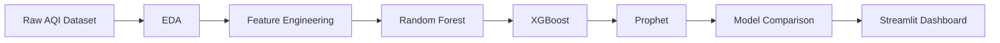

# <div align="center">

# 🌍 Air Quality Analytics & AQI Forecasting Platform


</div>

---
<!-- Animated Header -->

<div align="center">


</div>


<div align="center">


</div>


<div align="center">


</div>


<div align="center">


</div>


---

<div align="center">

### 🌫️ Pollution Never Sleeps. Neither Does Data.


</div>

---

---

# 📌 Overview

> Predicting tomorrow's air before tomorrow arrives.

Air pollution threatens millions of lives every year.

This project provides an **AI-powered Air Quality Analytics Platform** capable of

✅ Historical Analysis

✅ AQI Forecasting

✅ Pollution Pattern Detection

✅ Health Advisory Generation

✅ Interactive Dashboard Visualization

---

# 🖼 Demo Preview

<p align="center">


</p>

---

# 🧠 Machine Learning Models

| Model            | R² Score | MAE     | RMSE    |
| ---------------- | -------- | ------- | ------- |
| 🌲 Random Forest | 0.999999 | 0.0503  | 0.1656  |
| 🚀 XGBoost       | 0.999983 | 0.4436  | 0.7344  |
| 🔮 Prophet       | 0.926510 | 36.9273 | 48.4374 |

---

# ⚙ Tech Stack

<div align="center">


</div>

---

# 🔄 Workflow



---

# 📂 Repository Structure

```text
AirQualityProject/


├── data/


├── notebooks/


├── dashboard/


├── models/


├── reports/


├── presentation/


├── assets/


├── requirements.txt


└── README.md
```

---

# 📊 Dashboard Features

<details>

<summary>🌍 AQI Gauge Meter</summary>

Displays current AQI with dynamic color zones.

</details>

<details>

<summary>📈 Historical Trends</summary>

Interactive Plotly charts.

</details>

<details>

<summary>🚨 Health Advisory</summary>

Personalized health recommendations.

</details>

<details>

<summary>🔮 AQI Prediction</summary>

Compare RF, XGBoost and Prophet outputs.

</details>

---

# 🖼 Screenshots

### Dashboard

<p align="center">


</p>

### Forecast

<p align="center">


</p>

### Feature Importance

<p align="center">


</p>

---

# 🚀 Installation

```bash
git clone https://github.com/yourusername/AirQualityProject.git


cd AirQualityProject


pip install -r requirements.txt
```

---

# ▶ Run Dashboard

```bash
streamlit run dashboard/app.py
```

---

# 🌱 Sustainable Development Goals

| Goal   | Description                        |
| ------ | ---------------------------------- |
| SDG 3  | Good Health and Well-being         |
| SDG 11 | Sustainable Cities and Communities |
| SDG 13 | Climate Action                     |

---

# 👨‍💻 Contributors

<table>

<tr>

<td align="center">


<br>

<b>Shayan Akhtar Abedeen</b>

</td>

<td align="center">


<br>

<b>Aman Singh</b>

</td>

<td align="center">


<br>

<b>Aryan Singh</b>

</td>

</tr>

</table>

---

# ⭐ Support

If this project helped you,

give it a ⭐ on GitHub.

<p align="center">


</p>
